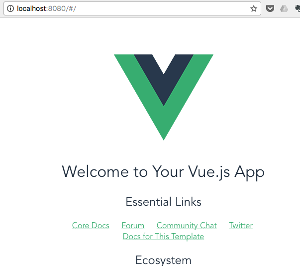
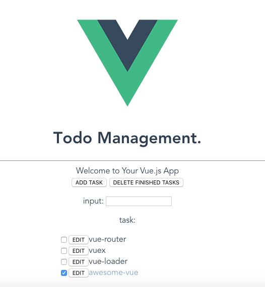

# tutorial_vuejs_todo_management

Vue.jsのtutorial用リポジトリ

## Build Setup

``` bash
# install dependencies
npm install

# serve with hot reload at localhost:8080
npm run dev

# build for production with minification
npm run build

# build for production and view the bundle analyzer report
npm run build --report

# run unit tests
npm run unit

# run all tests
npm test
```

F/or detailed explanation on how things work, checkout the [guide](http://vuejs-templates.github.io/webpack/) and [docs for vue-loader](http://vuejs.github.io/vue-loader).


## チュートリアルのゴール

* vue-cliをつかってプロジェクトを作成する
* Vue.jsでTodoリストアプリケーションを作ってみる
* 作成したアプリケーションをvue-loader、webpackでビルド／バンドルして、github-pagesで配信してみる

### できたらやりたい

* コンポーネントに分割（親コンポーネント・子コンポーネント間でのデータのやり取り）
* Vuexの導入

リポジトリ: https://github.com/sin-tanaka/vuejs_tutorial_todo_management
github-pages: https://sin-tanaka.github.io/vuejs_tutorial_todo_management/

## 環境

```
mac os: 10.11.6
node: v6.11.3
npm: 3.10.10
エディター: Pycharm # IntelliJ系のIDEに*.vueファイルの
```

筆者はnodeもnpmもあまり詳しくないのですが各自入れておいて下さい。
npmは、-g --save-dev --saveのオプションだけ把握していればとりあえず大丈夫です。

## Setup

まずはvue-cliをinstallします。
vue-cliは雛形からプロジェクトを作成してくれる公式ツールです。公式には、「nodeやnpm、webpackに詳しくないならあまり使わないほうがいいよ」と書いてあるのですがとても便利なので使います。

```bash
npm install -g vue-cli
```

vue-cliのversionを確認し、 `vue init <template> <project-name>` でプロジェクトを作成します。
ここではwebpackというテンプレートを使い、tutorial_vuejs_todo_managementというプロジェクト名にしています。

この時いくつか質問されます。基本的にそのままでいいと思いますが、私はLinterとe2eテストのツールは外しています。
尚、公式ではLinterを使うことが推奨されています。が、特定のjsコーディング規約に慣れていない人には結構つらいです。これを機会に慣れるのも有りだと思います。

ここでは初学者向けのチュートリアルということで外しています。

```bash
% vue --version
2.8.2
% vue init webpack tutorial_vuejs_todo_management                                       

? Project name tutorial_vuejs_todo_management
? Project description A Vue.js project
? Author Shintaro Tanaka
? Vue build standalone
? Install vue-router? Yes
? Use ESLint to lint your code? No
? Setup unit tests with Karma + Mocha? Yes
? Setup e2e tests with Nightwatch? No

   vue-cli · Generated "tutorial_vuejs_todo_management".

   To get started:

     cd tutorial_vuejs_todo_management
     npm install
     npm run dev

   Documentation can be found at https://vuejs-templates.github.io/webpack
```

`vue init` を実行したディレクトリにプロジェクトが作成されたので、`get started` の通りにコマンドを実行してみます。

```bash
cd tutorial_vuejs_todo_management
npm install
npm run dev
```

上手く行けば`localhost:8080` でブラウザが開いて以下の画面が表示されるはずです。




`npm run dev` を走らせたままファイルを編集してみるとリアルタイムでコンパイルが走り、画面が更新されるかと思います。

主にいじっていくファイルは以下になります。他はだいたい設定ファイルです。筆者も設定ファイルについてはよく分かっていないのですが、よく分かって無くても動くものが作れてしまうのがvue-cliを使うメリットだと思います。

```bash
./index.html
./src
├── App.vue
├── assets
│   └── logo.png
├── components
│   └── Hello.vue
├── main.js
└── router
    └── index.js
```


一つずつザックリみて、全体の流れを把握してみます。

`index.html`
```html
<!DOCTYPE html>
<html>
  <head>
    <meta charset="utf-8">
    <title>tutorial_vuejs_todo_management</title>
  </head>
  <body>
    <div id="app"></div>
    <!-- built files will be auto injected -->
  </body>
</html>
```
これがルートのファイルっぽいですね。
cssもjsも読み込んでいませんが、最終的にはWebpackなどで一つのscriptファイルにバンドルされます。

`<div id="app"></div>` を覚えておいて下さい。

`src/main.js`
```js
// The Vue build version to load with the `import` command
// (runtime-only or standalone) has been set in webpack.base.conf with an alias.
import Vue from 'vue'
import App from './App'
import router from './router'

Vue.config.productionTip = false

/* eslint-disable no-new */
new Vue({
  el: '#app',
  router,
  template: '<App/>',
  components: { App }
})
```

ここではVueインスタンスを作成して、Appコンポーネントをindex.htmlのid=appの要素に紐付けています。
また、App、routerというモジュールを読み込んでいるようです。


`src/App.vue`
```vue
<template>
  <div id="app">
    
    <router-view></router-view>
  </div>
</template>

<script>
export default {
  name: 'app'
}
</script>

<style>
#app {
  font-family: 'Avenir', Helvetica, Arial, sans-serif;
  -webkit-font-smoothing: antialiased;
  -moz-osx-font-smoothing: grayscale;
  text-align: center;
  color: #2c3e50;
  margin-top: 60px;
}
</style>
```

先程読み込んでいたAppの実体です。`*.vue`という拡張子ですが、これはVueコンポーネントを記述するものです。
vue-loaderというモジュールでブラウザで読み込める形へコンパイルされます。
ここではAppコンポーネントを定義しています。
Helloコンポーネントの説明のときに詳しく説明しますので、ここではザックリ中身を見てみます。

<template>の中身を見ると、画面のVueのロゴはAppコンポーネントで出力しているようです。
又、`` タグ下の`<router-view>` というタグが気になりますね。

`src/router/index.js`
```js
import Vue from 'vue'
import Router from 'vue-router'
import Hello from '@/components/Hello'

Vue.use(Router)

export default new Router({
  routes: [
    {
      path: '/',
      name: 'Hello',
      component: Hello
    }
  ]
})
```
`<router-view>` の実体は`vue-router` ここで定義されています。`vue-router` はルーティングと、それに対応するコンポーネントを決めています。
ここでは`/` にアクセスした時、Helloコンポーネントを出力するように設定しています。ルーティングを追加するのは簡単で、routesの配列にオブジェクトを追加していくだけです。
ここではHogeコンポーネントがあると仮定し、`/hoge` にアクセスした時Hogeコンポーネントを返すルーティングを設定する例を示します。

`src/router/index.jsにルーティングを追加した例`
```js
export default new Router({
  routes: [
    {
      path: '/',
      name: 'Hello',
      component: Hello
    },
    {
      path: '/hoge',
      name: 'Hoge',
      component: Hoge
    }
  ]
})
```


router-viewではルートにアクセスしたとき、Helloコンポーネントを出力していることが分かりました。
Helloコンポーネントを見てみます。

`src/components/Hello.vue`
```vue
<template>
  <div class="hello">
    <h1>{{ msg }}</h1>
    <h2>Essential Links</h2>
    <ul>
      <li><a href="https://vuejs.org" target="_blank">Core Docs</a></li>
      <li><a href="https://forum.vuejs.org" target="_blank">Forum</a></li>
      <li><a href="https://chat.vuejs.org" target="_blank">Community Chat</a></li>
      <li><a href="https://twitter.com/vuejs" target="_blank">Twitter</a></li>
      <br>
      <li><a href="http://vuejs-templates.github.io/webpack/" target="_blank">Docs for This Template</a></li>
    </ul>
    <h2>Ecosystem</h2>
    <ul>
      <li><a href="http://router.vuejs.org/" target="_blank">vue-router</a></li>
      <li><a href="http://vuex.vuejs.org/" target="_blank">vuex</a></li>
      <li><a href="http://vue-loader.vuejs.org/" target="_blank">vue-loader</a></li>
      <li><a href="https://github.com/vuejs/awesome-vue" target="_blank">awesome-vue</a></li>
    </ul>
  </div>
</template>

<script>
export default {
  name: 'hello',
  data () {
    return {
      msg: 'Welcome to Your Vue.js App'
    }
  }
}
</script>

<!-- Add "scoped" attribute to limit CSS to this component only -->
<style scoped>
h1, h2 {
  font-weight: normal;
}

ul {
  list-style-type: none;
  padding: 0;
}

li {
  display: inline-block;
  margin: 0 10px;
}

a {
  color: #42b983;
}
</style>
```

少々長いので、3つに分割してみます。
```html
<template>
  <div class="hello">
    <h1>{{ msg }}</h1>
    <h2>Essential Links</h2>
    <ul>
      <li><a href="https://vuejs.org" target="_blank">Core Docs</a></li>
      <li><a href="https://forum.vuejs.org" target="_blank">Forum</a></li>
      <li><a href="https://chat.vuejs.org" target="_blank">Community Chat</a></li>
      <li><a href="https://twitter.com/vuejs" target="_blank">Twitter</a></li>
      <br>
      <li><a href="http://vuejs-templates.github.io/webpack/" target="_blank">Docs for This Template</a></li>
    </ul>
    <h2>Ecosystem</h2>
    <ul>
      <li><a href="http://router.vuejs.org/" target="_blank">vue-router</a></li>
      <li><a href="http://vuex.vuejs.org/" target="_blank">vuex</a></li>
      <li><a href="http://vue-loader.vuejs.org/" target="_blank">vue-loader</a></li>
      <li><a href="https://github.com/vuejs/awesome-vue" target="_blank">awesome-vue</a></li>
    </ul>
  </div>
</template>
```
画面下部のリンクはこの部分に記述されているようです。`{{ msg }}` や`<template>` を除けば普通のhtmlですね。

```html
<script>
export default {
  name: 'hello',
  data () {
    return {
      msg: 'Welcome to Your Vue.js App'
    }
  }
}
</script>
```
`<script>` タグで囲われているのでjsっぽいですね。上で出てきた`{{ msg }}` もここで定義されている感じです。

```html
<!-- Add "scoped" attribute to limit CSS to this component only -->
<style scoped>
h1, h2 {
  font-weight: normal;
}

ul {
  list-style-type: none;
  padding: 0;
}

li {
  display: inline-block;
  margin: 0 10px;
}

a {
  color: #42b983;
}
</style>
```
ここも`<style>` タグで囲われているので普通のcssっぽいですね。`scoped` というプロパティが気になるくらいでしょうか。

ひと通り見終えたので、このコンポーネントで行っているであろうことをまとめてみます。
* `<template>` にhtml構造の記述
* `<script>` にjsを記述　html中に書かれているmsgもここで定義
* `<style>` にcssを記述

上記の3点をひとまとめにして`*.vue` というファイルとしているようです。

html、js、cssは分けて記載するのが一般的ですが、コンポーネントという考えでは、それらをまとめて記述することで、再利用性や、見通しを良くしています。
責務の分担という意味ではオブジェクト指向的でもあります。

Vueコンポーネントの詳細は以下のドキュメントを参照下さい。

[Vue Component の仕様](https://vue-loader.vuejs.org/ja/start/spec.html)

ざっくり解説すると、

`<template>`タグは文字列に展開され、Vueコンポーネントのtemplateオプションに渡されます。

また、`<style>` タグでは`scoped` を指定することでscoped cssを実現しています。この`<style>` タグに書かれたCSSは、このコンポーネントの中でのみ適用されます。
なのでBEMほどカッチリとしたCSSを書かなくてもOKです（ただし一貫性は持ったほうが良いと思いますし、タグ指定よりclassやid指定のほうが速いです）

[スコープ付き CSS](https://vue-loader.vuejs.org/ja/features/scoped-css.html)


`<script>`タグではVueコンポーネントのオプションのオブジェクトをエクスポートします。vue-loaderを通して実体はVueインスタンスが作られます。

```js
new Vue({
  name: 'app'
})
```


ここではVueコンポーネントに渡す引数として、dataを渡しています。
このときdataは
* 関数であること
* コンポーネントで扱いたいデータをオブジェクトに定義し、returnする

ことで定義したデータは`<template>` の中で`{{ }}`を囲うことで出力することができます。

画面に出力されている`Welcome to Your Vue.js App` はVueインスタンスの中に定義されたmsgを出力していることがわかります。


ちなみにdataオプションは以下のように書くことも可能です。
```js
// OK
{
data: function () {
    return {
      msg: 'Welcome to Your Vue.js App'
    }
  }
}
```

このときアロー関数を使わないようにしましょう、変数のスコープが変わってしまうため推奨されません。

[インスタンス内において、アロー関数の「this」はインスタンスを参照しない](http://nayucolony.hatenablog.com/entry/2017/05/31/232024)
```js
// NG
data: () => {
    return {
      msg: 'Welcome to Your Vue.js App'
    }
  }
```


ここまでで全体の流れの説明は終わりです。

---

ここからはこれらのコンポーネントを修正して、Todoリストを作ってみます。

Todoリストの要件は以下のように定義しておきます。

* Todoはリストで一覧表示すること
* Todoはテキストボックスから追加できること
* それぞれのTodoにはチェックボックスが付いており、それを切り替えることでTodoの状態（未達成／達成済）を切り替えること
* チェック済のTodoを一括で消すボタンがあること
* それぞれのTodoは編集可能なこと

一般的なCRUDを持つインターフェースだと思います。

最終的にできあがったTodoリストは`github-pages`を使って配信するところまでを一先ずの目標とし、その後可能であれば
* コンポーネントの分割（親子間でのデータのやり取り）
* Vuexの導入

まで出来れば理想ですが一先ず一つのコンポーネントにべた書きでTodoリストを作ってみましょう。


その前に、`*.vue` ファイル内の`<style>` タグ内で、`SASS/SCSS` を書けるようにしましょう（これは好みなので、普通のCSSでいい人は入れなくてもよいです。但しサンプルコードはSCSSで書かれています）

```bash
npm install sass-loader node-sass --save-dev
```

これでSCSSが書けるようになりました。
まずはhtmlとCSSでTodoリストのイメージを組み上げてみます。

diff: https://github.com/sin-tanaka/vuejs_tutorial_todo_management/commit/07faa150878b8dade8fa48ee4f58168da31d08a2

`src/App.vue`
```vue
<template>
  <div id="app">
    
    <h1>Todo Management.</h1>
    <hr />
    <router-view></router-view>
  </div>
</template>

<script>
export default {
  name: 'app'
}
</script>

<style>
#app {
  font-family: 'Avenir', Helvetica, Arial, sans-serif;
  -webkit-font-smoothing: antialiased;
  -moz-osx-font-smoothing: grayscale;
  text-align: center;
  color: #2c3e50;
  margin-top: 60px;
}
</style>
```

`src/components/Hello.vue`
```vue
<template>
  <div>
    {{ msg }}
    <form>
      <button>ADD TASK</button>
      <button>DELETE FINISHED TASKS</button>
      <p>input: <input type="text"></p>
      <p>task:</p>
    </form>
    <div class="task-list">
      <label class="task-list__item"><input type="checkbox"><button>EDIT</button>vue-router</label>
      <label class="task-list__item"><input type="checkbox"><button>EDIT</button>vuex</label>
      <label class="task-list__item"><input type="checkbox"><button>EDIT</button>vue-loader</label>
      <label class="task-list__item--checked"><input type="checkbox" checked><button>EDIT</button>awesome-vue</label>
    </div>
  </div>
</template>

<script>
export default {
  name: 'hello',
  data () {
    return {
      msg: 'Welcome to Your Vue.js App'
    }
  }
}
</script>

<!-- Add "scoped" attribute to limit CSS to this component only -->
<style lang="scss" scoped>
@mixin flex-vender() {
  display: flex;
  display: -webkit-flex;
  display: -moz-flex;
  display: -ms-flex;
  display: -o-flex;
}
.task-list {
  @include flex-vender;
  flex-direction: column;
  align-items: center;
  &__item {
    width: 270px;
    text-align: left;
    $element: #{&};
    &--checked {
      @extend #{$element};
      color: #85a6c6;
    }
  }
}
</style>
```

以下のような画面になるはずです。このとき、`npm run dev` は起動しっぱなしでOKですソースを編集すると自動でコンパイル・リロードまでしてくれることが確認できると思います（ホットリロード）。



Todoのテキストは初期画面のテキストをそのまま使っています。各自変えてもらって問題ないです。

htmlとcssに手を加えただけなので、このままでは何も動作しません。
次に、ボタンやテキストエリアに動作やデータを紐付けていきます。
まずは、`src/components/Hello.vue` で繰り返し出現しているTodoの一覧表示を`v-for` ディレクティブを使ってリストレンダリングしてみます。

diff: https://github.com/sin-tanaka/vuejs_tutorial_todo_management/commit/852419626e620efa0397f685e67f79b2ee926998

`src/components/Hello.vue` 
```vue
<template>
  <div>
    {{ msg }}
    <form>
      <button>ADD TASK</button>
      <button>DELETE FINISHED TASKS</button>
      <p>input: <input type="text"></p>
      <p>task:</p>
    </form>
    <div class="task-list">
      <label class="task-list__item"
             v-for="todo in todos">
        <input type="checkbox"><button>EDIT</button>{{ todo.text }}
      </label>
    </div>
  </div>
</template>

<script>
export default {
  name: 'hello',
  data () {
    return {
      msg: 'Welcome to Your Vue.js App',
      todos : [
        {text : 'vue-router', done: false},
        {text : 'vuex', done: false},
        {text : 'vue-loader', done: false},
        {text : 'awesome-vue', done: true },
      ]
    }
  }
}
</script>

<!-- Add "scoped" attribute to limit CSS to this component only -->
<style lang="scss" scoped>
@mixin flex-vender() {
  display: flex;
  display: -webkit-flex;
  display: -moz-flex;
  display: -ms-flex;
  display: -o-flex;
}
.task-list {
  @include flex-vender;
  flex-direction: column;
  align-items: center;
  &__item {
    width: 270px;
    text-align: left;
    $element: #{&};
    &--checked {
      @extend #{$element};
      color: #85a6c6;
    }
  }
}
</style>
```

`<template>` の中で繰り返し表れていた`<label>` に`v-for` が追加され、Todoのテキストはdataオプションでreturnしているオブジェクトの配列に
移動しました。
`v-for="todo in todos"` では、dataに定義したtodos配列内のオブジェクトを一つずつ取り出し、todoに入れる、という処理をしています。分かる人であれば、単にtodosをイテレータとして扱っていると思ってもらえればよいと思います。
取り出したtodoの要素へのアクセスはtodo.text、todo.doneのようにアクセスできます。

ここではtodoにtextとdone（todo済フラグ）を定義しておきます。


